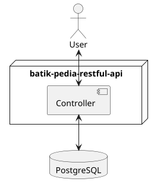

## Tentang Proyek ini

Batik Pedia adalah aplikasi web berbasis Laravel yang dibuat untuk mendokumentasikan kursus membatik, galeri batik, dan
informasi terkait budaya batik Indonesia. Proyek ini menggunakan framework Laravel karena sintaksnya yang elegan dan
workflow pengembangan yang menyenangkan. Proyek ini dibuat atas dasar kebutuhan aplikasi Android Batik Pedia.

## Alur Aplikasi

## Fitur Utama Batik Pedia

1. Manajemen Kursus Membatik
    - Tambah, ubah, hapus kursus membatik lengkap dengan gambar, harga, dan deskripsi.
2. Manajemen Video Membatik
    - CRUD data video membatik.
3. Manajemen Wisata Batik
    - CRUD data wisata batik Nusantara.
4. Manajemen provinsi di Indonesia
    - CRUD data provinsi di Indonesia.
5. Manajemen Berita Batik
    - CRUD data berita seputar batik.
6. Manajemen Rekomendasi Event Batik.
    - CRUD data rekomendasi event batik.
7. Manajemen Katalog Batik.
    - CRUD data batik nusantara.

## Link Dokumentasi Postman

Untuk dapat menggunakan Rest API ini, silahkan bisa mengecek ke link berikut: [Dokumentasi API](https://documenter.getpostman.com/view/44668350/2sB3dLUBwi)
 
